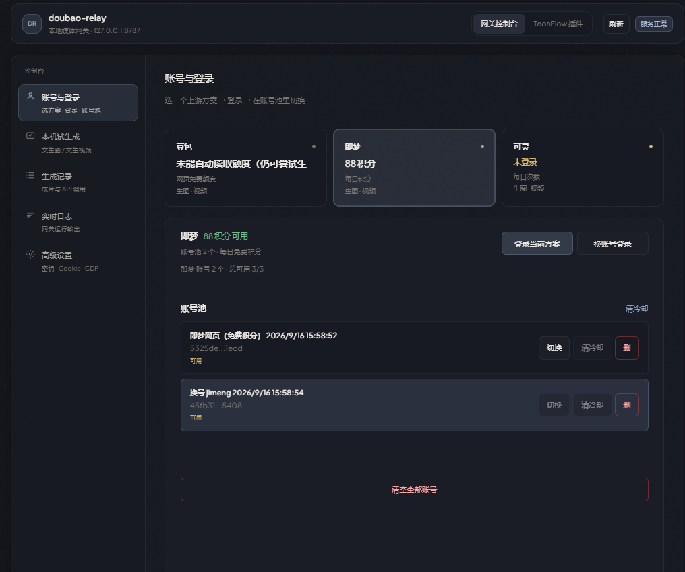
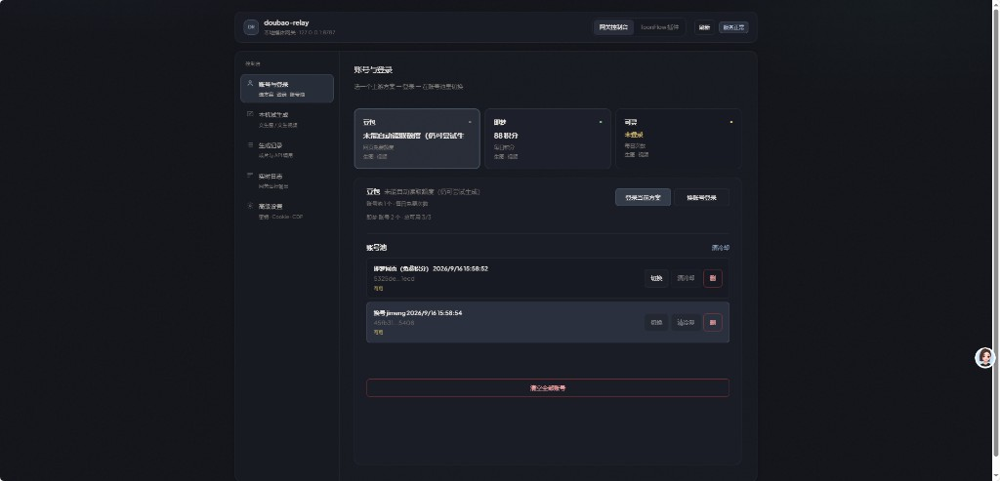
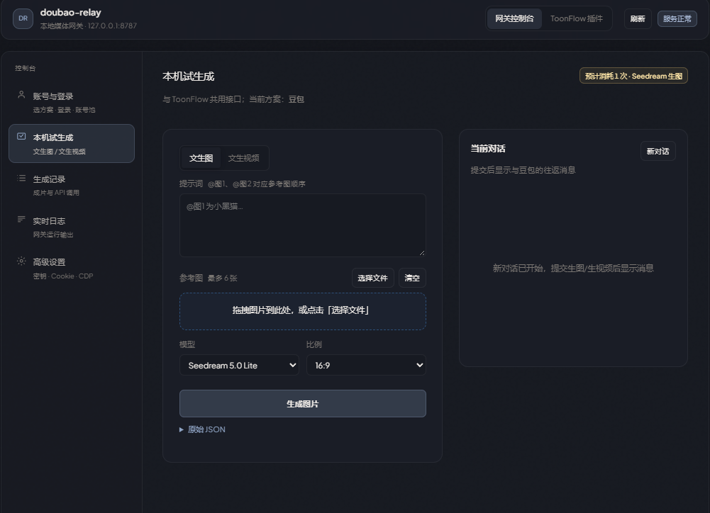
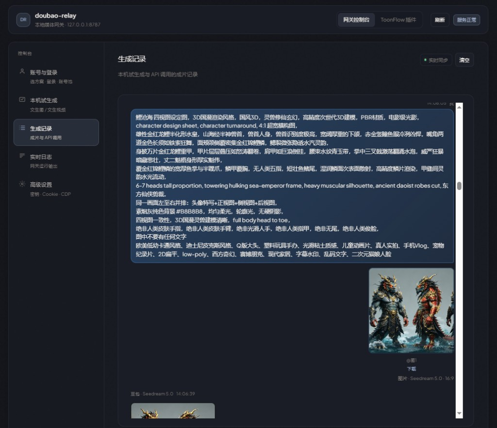
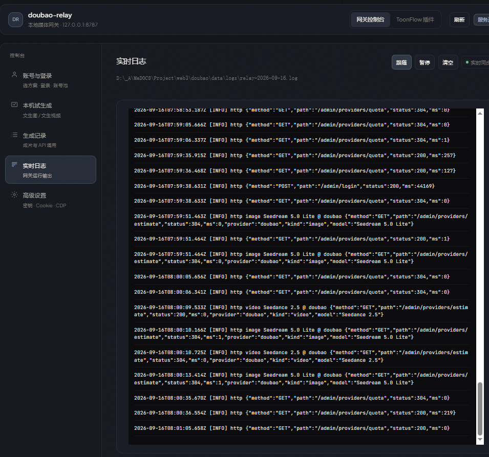
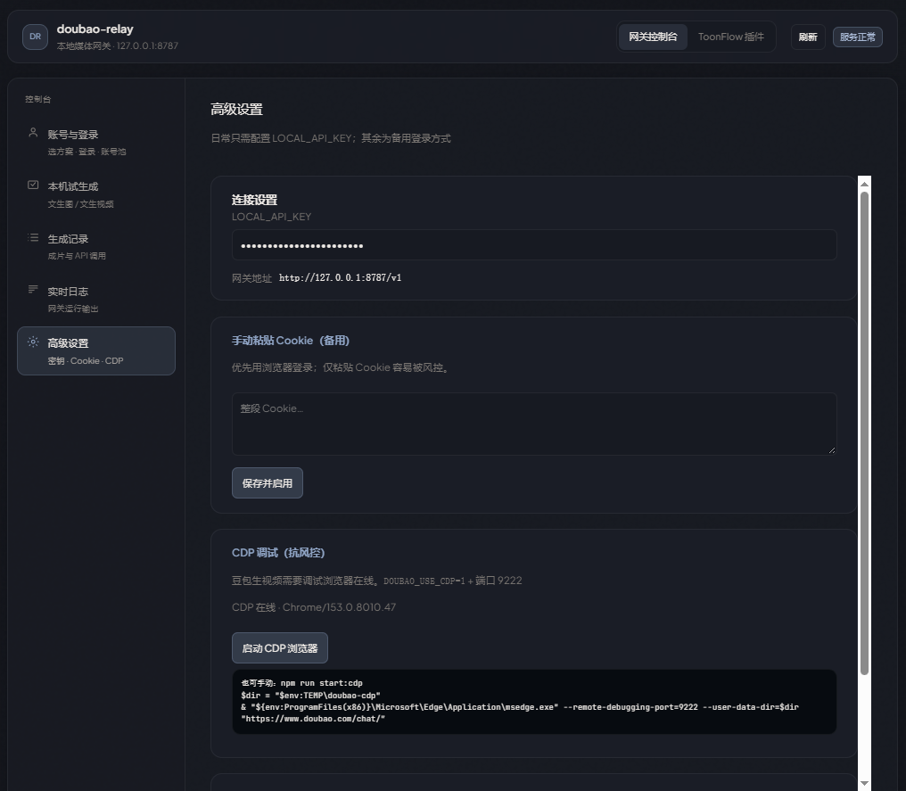

# doubao-relay · 本地媒体网关

把 **豆包 / 即梦 / 可灵** 等网页额度，以及 **Cursor 编剧**、火山方舟等上游，统一成本机 **OpenAI 兼容 API**（默认 `http://127.0.0.1:8787/v1`）。自带深色管理页：**账号池、本机试生成、成片记录、实时日志、ToonFlow 插件中心**。无 Docker，仅限个人自用。



## 它解决什么问题

官方火山方舟要 Key、要计费；各平台网页版又难接工作流。本项目在本机起一个网关，用你自己的登录态调用网页能力（或内嵌即梦 SDK），再把结果以标准 HTTP 交给 **ToonFlow**、脚本或其它客户端。

```text
ToonFlow / 脚本 / 任意 OpenAI 客户端
        │  Authorization: Bearer LOCAL_API_KEY
        ▼
  :8787  doubao-relay（管理页 + /v1 API）
        ├─ 生图 / 生视频：多方案路由（doubao · jimeng · jimeng-api · kling · …）
        ├─ 编剧文本：cursor-relay（Cursor 订阅额度）
        └─ 豆包对话：内部上游 :8000 doubao-free-api（npm start 一并拉起）
```

## 功能一览

| 模块 | 说明 |
|------|------|
| **网关控制台** | 顶栏切换「网关控制台 / ToonFlow 插件」，侧栏五块：账号、试生成、记录、日志、设置 |
| **多方案账号池** | 豆包 / 即梦 / 可灵分方案登录；切换、清冷却、删号；额度条实时刷新 |
| **本机试生成** | 文生图 / 文生视频，与 ToonFlow 共用接口；参考图 `@图N`、模型与比例下拉 |
| **生成记录** | 成片与 API 调用统一时间线，可下载、看提示词与模型信息 |
| **实时日志** | 按天日志文件 + 页面跟随 / 暂停 / 清空 |
| **ToonFlow 插件** | 内置供应商 `.ts` 列表、复制路径、按插件查看调用日志 |
| **OpenAI 兼容 API** | `/v1/images/generations`、`/v1/videos/generations`、`/v1/chat/completions` |
| **即梦 API 内嵌** | 进程内 SDK，**无需独立 :5100**；管理页登录即可，ToonFlow 不用填 SessionID |
| **CDP 抗风控** | 本机 Chrome/Edge 远程调试，降低豆包 `shark` / `710022004` |

## 快速开始

需要 **Node.js ≥ 22.13**（见 `package.json` engines）。Windows 示例：

```powershell
cd doubao
copy .env.example .env
npm run setup
npm start
```

浏览器打开 **http://127.0.0.1:8787**：

1. **网关控制台 → 账号与登录**：选豆包 / 即梦 / 可灵 → **登录当前方案**（或 **换账号登录** 加入账号池）
2. 顶栏 **ToonFlow 插件**：复制对应 `toonflow/*.ts` 路径，在 ToonFlow 导入；API 填 `LOCAL_API_KEY`，地址填 `http://127.0.0.1:8787/v1`
3. 需要豆包视频抗风控时，在 **高级设置** 启用 CDP 或运行 `npm run start:cdp`

| 地址 | 说明 |
|------|------|
| http://127.0.0.1:8787 | 管理页与对外网关 |
| http://127.0.0.1:8787/v1 | OpenAI 兼容 API 根路径 |
| http://127.0.0.1:8000 | 豆包对话上游（仅本机，由 `npm start` 拉起） |

单独弹窗登录（命令行）：

```bash
npm run login
npm run login:switch   # 换账号，写入账号池
```

## 网关控制台

顶栏 **「网关控制台」** 左侧为五个子页，与截图一致。

### 账号与登录



- **方案卡片**：豆包（网页免费额度）、即梦（积分 / 每日免费）、可灵（每日次数）等；点选后下方为当前方案操作区
- **登录当前方案 / 换账号登录**：浏览器扫码或 CDP 窗口登录，会话写入 `data/`，**不要用豆包 sessionid 当 API Bearer**
- **账号池**：多账号列表、**切换**、单号 **清冷却**、删除；底部 **清空全部账号**
- 查询已配置上游：`GET /admin/providers`

### 本机试生成



- 与 ToonFlow **同一套 HTTP 接口**；顶栏显示当前方案与 **预计消耗**
- **文生图 / 文生视频** 页签；提示词支持 `@图1`、`@图2` 对应参考图顺序（最多 6 张）
- 模型（如 Seedream 5.0 Lite）、比例（16:9 等）；右侧为当前轮次对话/结果区
- 可展开 **原始 JSON** 便于对照请求体

### 生成记录



- **实时同步** 开关；**清空** 仅清前端展示（日志文件仍按天保留）
- 每条记录含提示词、模型、比例、缩略图与 **下载** 链接

### 实时日志



- 显示当前日志文件路径（默认 `data/logs/relay-YYYY-MM-DD.log`）
- **跟随 / 暂停 / 清空**；便于排查 provider 路由、额度估算、HTTP 耗时

### 高级设置



- **LOCAL_API_KEY** 与 **网关地址** `http://127.0.0.1:8787/v1`（多数场景只配这一项即可）
- **手动粘贴 Cookie（备用）**：优先用页面登录；纯 Cookie 易触发风控
- **CDP 调试（抗风控）**：状态、**启动 CDP 浏览器**；亦可 `npm run start:cdp` 或按页内 PowerShell 示例启动 Edge/Chrome `:9222`

`.env` 常用 CDP：

```env
DOUBAO_USE_CDP=1
DOUBAO_CDP_URL=http://127.0.0.1:9222
```
